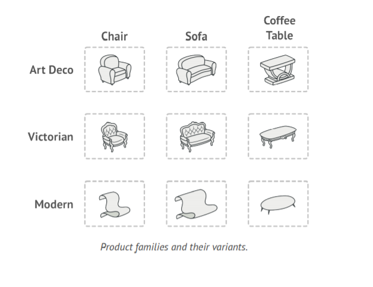
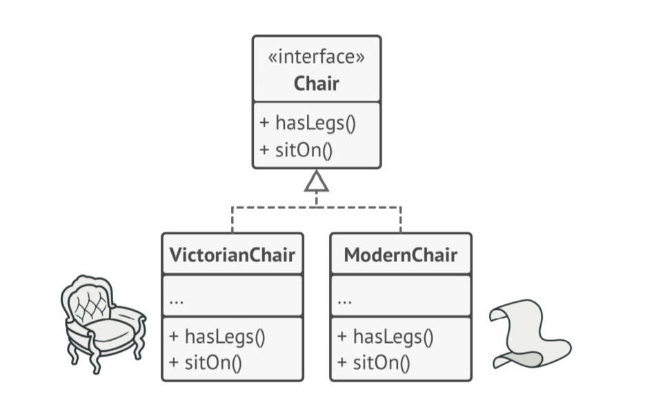
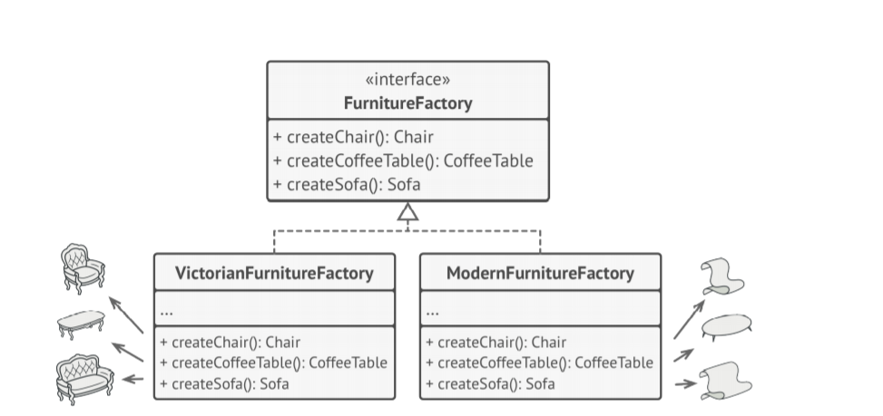
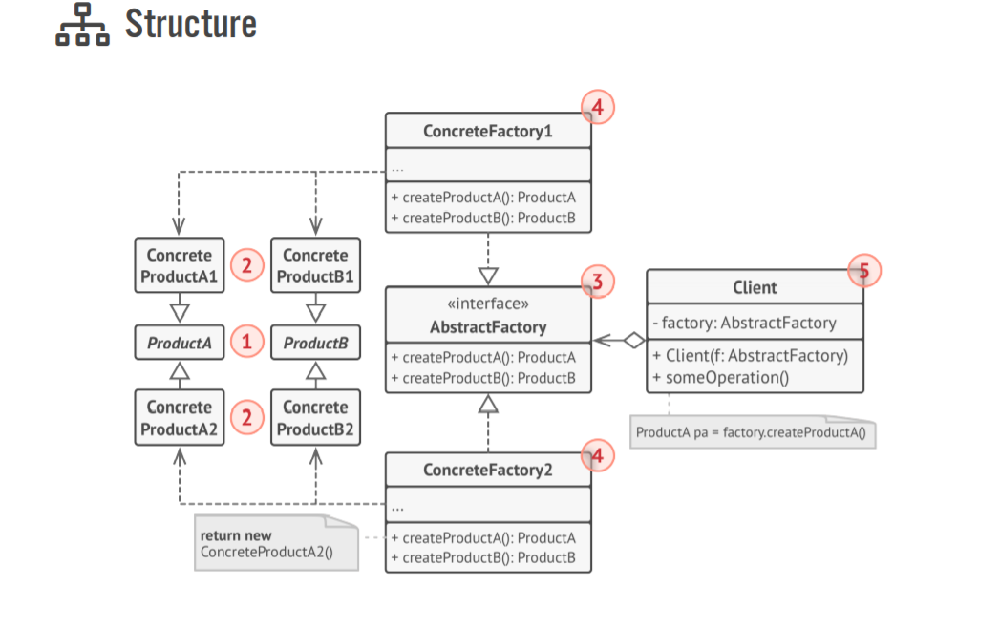
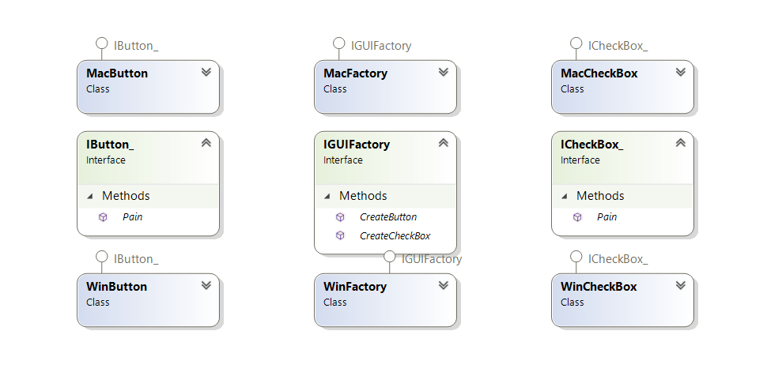

## Đặt vấn đề
Ý tưởng là: Trang trí giả lập cho một cửa hàng. Chúng ta cần tạo một vài class đại diện:
	- một vài nhóm sản phẩm: ghế + sofa + Bàn coffee 
    - một vài biến thể của sản phẩm trên như: Modern, Victorian,ArtDeco
     
    - Bây giờ chúng ta cần tạo ra các đồ dùng đó trong chương trình của chúng ta và các sản phẩm cùng loại biến thể phải đi cùng nhau. Vì khách hàng sẽ cảm thấy điên dồ, khi chúng ta cho một chiếc ghế victorian đi với cá sofa Art Deco  
    - Suy nghĩ xem, chúng ta sẽ không thể thay đổi code, khi thêm một sản phẩm mới hoặc một loại biến thể, và không muốn thay đổi core code.
    - Để làm vậy có cách nào không nhỉ? Đọc tiếp nhá........

## Cách giải quyết:
Ồ có vẻ chúng ta đã có Key để giải quyết vấn đề này AbstractFactory. Vậy để thi triển chúng ta cần làm gì:

* Khai báo các interface của từng sản phẩm (Ghế, Bàn coffee, Sofa)
* Và chúng ta sẽ cho tất cả loại biến thể của sản phẩm bọc lấy thực hiện Interface. Nếu bạn không biết tại sao chung ta cần làm như vậy thì tôi  
    khuyên bạn nên dựng lại và tìm hiểu vài thứ khá là hưu ích cho công việc của một lập trình viên. 
    Nó rất hữu ích và sẽ không mất quá nhiều thời gian để biết(còn để hiểu rõ thì chắc sẽ lâu):
    - OOP Interface
    - Solid
    - Strategy Design Pattern

* Tiếp tục nào bây giờ ta đến với món chính Abstract Factory một interface với một danh sách các hàm
để tạo các thành phần của bộ sản phẩm. Các method sẽ trả về các đối tượng trừu tượng(interface) của sản phẩm(tại sao hay đọc abstract)
* Bây giờ đến lúc tạo các sản phẩm biến thể như nào? Ta có thể thấy  Abstract Factory đã tạo ra các sản phẩm trừu tượng riêng biệt. Bây giờ chúng ta thực hiện
Abstract Factory(implement interface) để có thể tạo ra các sản phẩm trong một class Factory. nó sẽ trả lại bạn một lớp có bộ sản phẩm tương ứng

* 
## Ví dụ
* Một ví dụ khá hay ho đó là thành phần cross-platform UI mẫu này có thể sử dụng để tạo ra
* một vài loại UI. Ví dụ : Mac,Win,..sao cho tất cả các thành phần trong UI phù hợp với hệ điều hành đó
* 

- Code thì ở trong nhé các bạn có thể tham khảo

## Khả năng ứng dụng

* Sử dụng AbstractFactory khi code của bạn cần đáp ứng các dòng sản phẩm có liên quan bản chất, nhưng có nhiều biến thể.
Nhưng bạn không muốn nó bị phụ thuộc vào một class cụ thể. Để có thể mở rộng về mặt chức năng hoặc
không đoán trước được một loại sản phẩm mới sẽ xuất hiện
* AbstractFactory cung cấp cho bạn interface để bạn có thể tạo các loại sản phẩm có cùng họ. 
## Làm thể nào để thực hiện?
1. Đưa ra được cái nhìn tổng quan về họ sản phẩm  và các biến thể, thành phần
2. Định nghĩa ra các interface cho tất cả sản phẩm. Sau đó tạo ra tất cả các thực hiện của sản phẩm(implement inteface)
3. Định nghĩa ra interface AbstractFactory và các method tạo ra các sản phẩm Abstract, cần thiết cho họ sản phẩm(sản phẩm chung)
4.  Thực hiện cac factory class cụ thể , cho mỗi biến thể của sản phẩm
5. Sử dụng factory khởi tạo nó trong ứng dụng của bạn bằng một factory class cụ thể mong muốn. 
Nó có thể phụ thuộc vào configuration hoặc trên môi trường... Pass nó qua factory object để tất cả class nó tạo ra sản phẩm
6. Nếu bạn đang tái cấu trúc lại sản phẩm. Scan toàn bộ ứng dụng và sửa nó khởi tạo qua factory

## Pros and cons
- Đảm bảo sản phẩm mong muốn với factory là sẽ tương thích với nhau
- Tránh được khớp nối giữa một lớp cụ thể và một client code(người dùng lib,người dùng, giao diện...)
- SRP trong Solid. Có thể thực hiện tạo sản phẩm vào một nơi và tối ưu, tạo nó theo mong muốn một cách dễ dàng hơn
không bị phụ thuộc
- O/C P trong solid. Bạn có thể thêm một sản phẩm mới mà không phá vỡ tồn tại của client code
- Nhược điểm: Mã sẽ phức tạp hơn cần thiết. 